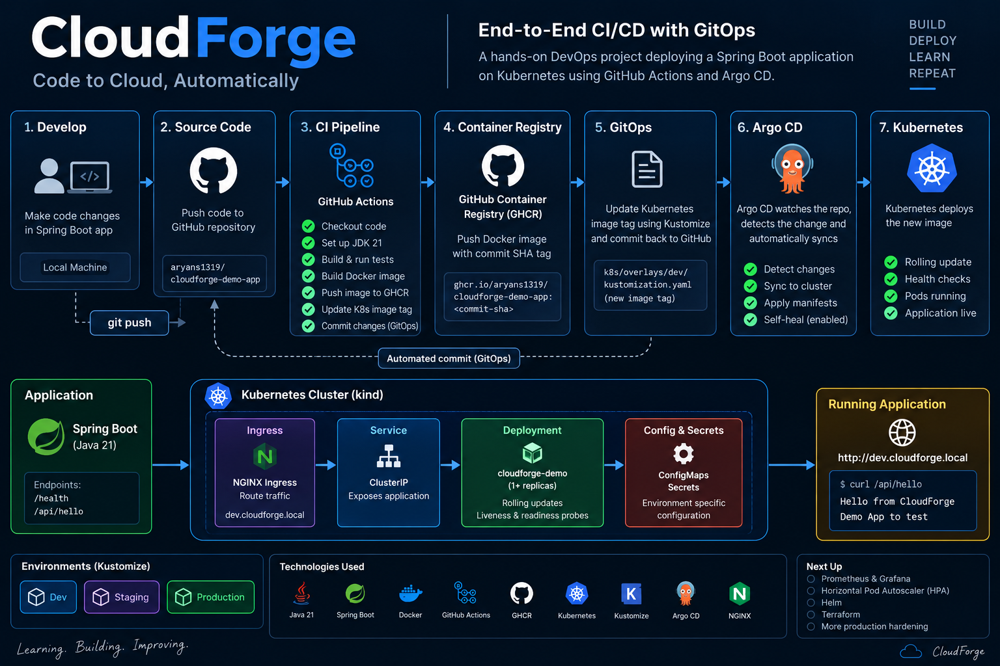

# CloudForge

### End-to-End CI/CD + GitOps Deployment on Kubernetes

CloudForge is a hands-on DevOps/Platform Engineering project built
around a Spring Boot application.

> **Code → GitHub Actions → Docker → GHCR → GitOps → Argo CD →
> Kubernetes**

## Architecture



*End-to-end CloudForge pipeline and Kubernetes runtime architecture.*


``` text
Developer
   │
   │ git push
   ▼
GitHub Repository
   │
   ▼
GitHub Actions
   ├── Build & test
   ├── Build Docker image
   ├── Push image to GHCR
   └── Update Kubernetes image tag
             │
             ▼
        GitOps commit
             │
             ▼
          Argo CD
       (dev environment)
             │
             ▼
        Kubernetes
             │
       ┌─────┴─────┐
       ▼           ▼
    Ingress      Deployment
       │             │
       ▼          ReplicaSet
    Service          │
                     ▼
                    Pod
                     │
                     ▼
               Spring Boot
```

## What has been implemented

### Application

-   Spring Boot
-   Java 21
-   `/health`
-   `/api/hello`

### Containerization

-   Docker
-   Eclipse Temurin 21 JRE
-   GitHub Container Registry (GHCR)
-   Commit SHA-based image tags

### Kubernetes

-   kind local cluster
-   Deployment, ReplicaSet and Pods
-   ClusterIP Service
-   NGINX Ingress
-   ConfigMap and Secret
-   Readiness and liveness probes
-   Rolling updates

### Multi-environment configuration

-   Dev
-   Staging
-   Production
-   Kustomize overlays
-   Environment-specific replica counts
-   Production CPU/memory requests and limits

### CI/CD and GitOps

-   GitHub Actions for build and test
-   Docker image build and push
-   Automated Kubernetes image-tag update
-   Argo CD for GitOps continuous delivery
-   Automated sync, pruning and self-healing for the dev Application

## CI/CD Flow

``` text
1. Developer changes code
          │
          ▼
2. git push origin main
          │
          ▼
3. GitHub Actions
   ├── Checkout source
   ├── Set up JDK 21
   ├── ./mvnw clean verify
   ├── Authenticate to GHCR
   ├── Build Docker image
   └── Push image using commit SHA
          │
          ▼
4. Update k8s/overlays/dev/kustomization.yaml
          │
          ▼
5. GitOps commit is pushed to GitHub
          │
          ▼
6. Argo CD detects the Git change
          │
          ▼
7. Argo CD synchronizes Kubernetes
          │
          ▼
8. Kubernetes performs a rolling update
          │
          ▼
9. New Pod runs the new image
```

Git is the desired-state source of truth for the Argo CD-managed dev
environment.

## Technology Stack

  Area            Technology
  --------------- ---------------------------
  Language        Java 21
  Application     Spring Boot
  Build           Maven
  Container       Docker
  Registry        GitHub Container Registry
  CI              GitHub Actions
  Orchestration   Kubernetes
  Local cluster   kind
  Configuration   Kustomize
  Ingress         NGINX Ingress Controller
  GitOps CD       Argo CD

## Repository Structure

``` text
cloudforge-demo-app/
├── .github/
│   └── workflows/
│       └── ci.yaml
├── k8s/
│   ├── base/
│   │   ├── configmap.yaml
│   │   ├── deployment.yaml
│   │   ├── ingress.yaml
│   │   ├── kustomization.yaml
│   │   ├── secret.yaml
│   │   └── service.yaml
│   └── overlays/
│       ├── dev/
│       │   ├── ingress-patch.yaml
│       │   └── kustomization.yaml
│       ├── staging/
│       │   └── ...
│       └── production/
│           └── ...
├── src/
├── Dockerfile
├── kind-config.yaml
├── pom.xml
└── README.md
```

## Local Development

### Prerequisites

-   Java 21
-   Docker
-   kind
-   kubectl

The repository includes the Maven Wrapper.

### Build and test

``` bash
./mvnw clean verify
```

### Run the application

``` bash
./mvnw spring-boot:run
```

Test:

``` bash
curl http://localhost:8080/health
curl http://localhost:8080/api/hello
```

## Docker

Build:

``` bash
docker build -t cloudforge-demo-app:local .
```

Run:

``` bash
docker run --rm -p 8080:8080 cloudforge-demo-app:local
```

Then:

``` bash
curl http://localhost:8080/health
```

## Kubernetes

Create the local kind cluster:

``` bash
kind create cluster --name cloudforge --config kind-config.yaml
```

Verify:

``` bash
kubectl get nodes
```

### Kustomize

Render Dev without applying:

``` bash
kubectl kustomize k8s/overlays/dev
```

Apply Dev:

``` bash
kubectl apply -k k8s/overlays/dev
```

Apply Staging:

``` bash
kubectl apply -k k8s/overlays/staging
```

Apply Production:

``` bash
kubectl apply -k k8s/overlays/production
```

## Environments

  Environment   Host                              Replicas
  ------------- ------------------------------- ----------
  Dev           `dev.cloudforge.local`                   1
  Staging       `staging.cloudforge.local`               2
  Production    `production.cloudforge.local`            3

Production also defines CPU and memory resource requests/limits.

For the local kind + NGINX Ingress setup, add:

``` text
127.0.0.1 cloudforge.local
127.0.0.1 dev.cloudforge.local
127.0.0.1 staging.cloudforge.local
127.0.0.1 production.cloudforge.local
```

to `/etc/hosts`.

## Health Probes

The application exposes:

``` text
/health
```

Kubernetes uses this endpoint for readiness and liveness checks.

The probes include startup delays because the Spring Boot application
needs time to initialize. This prevents Kubernetes from restarting the
container before the application is ready.

## Argo CD

The current Argo CD Application manages the Dev overlay:

``` text
k8s/overlays/dev
```

from the `main` branch and deploys it to the `dev` namespace.

Check:

``` bash
kubectl get applications -n argocd
```

Expected:

``` text
NAME             SYNC STATUS   HEALTH STATUS
cloudforge-dev   Synced        Healthy
```

### Argo CD UI

``` bash
kubectl port-forward svc/argocd-server -n argocd 8081:443
```

Open:

``` text
https://localhost:8081
```

Initial admin password:

``` bash
kubectl -n argocd get secret argocd-initial-admin-secret   -o jsonpath="{.data.password}" | base64 --decode
echo
```

## GitHub Actions

The workflow is:

``` text
.github/workflows/ci.yaml
```

It runs for pushes and pull requests targeting `main`.

Pipeline stages:

``` text
Checkout
   ↓
JDK 21
   ↓
Maven build + tests
   ↓
GHCR authentication
   ↓
Docker build
   ↓
Docker push
   ↓
Update Kubernetes image tag
   ↓
GitOps commit
```

Images use the Git commit SHA as the tag:

``` text
ghcr.io/aryans1319/cloudforge-demo-app:<commit-sha>
```

This makes the running image traceable to the source revision that
produced it.

## End-to-End Validation

The pipeline was tested with a real application change.

The `/api/hello` response was changed from:

``` text
Hello from CloudForge Demo App
```

to:

``` text
Hello from CloudForge Demo App to test
```

The change successfully flowed through:

``` text
Code change
    ↓
git push
    ↓
GitHub Actions
    ↓
Docker image → GHCR
    ↓
Kustomize image-tag update
    ↓
GitOps commit
    ↓
Argo CD: Synced / Healthy
    ↓
Kubernetes rolling update
    ↓
New image running
    ↓
curl /api/hello
```

The running endpoint returned the updated response, confirming the CI →
GitOps → Kubernetes flow end-to-end.

## Useful Commands

``` bash
# All Pods
kubectl get pods -A

# Dev Pods
kubectl get pods -n dev

# Deployment
kubectl get deployment -n dev

# Current image
kubectl get deployment cloudforge-demo -n dev   -o jsonpath='{.spec.template.spec.containers[0].image}'
echo

# Rollout status
kubectl rollout status deployment/cloudforge-demo -n dev

# Ingress
kubectl get ingress -A

# Application
curl http://dev.cloudforge.local/health
curl http://dev.cloudforge.local/api/hello

# Argo CD
kubectl get applications -n argocd
```

## Troubleshooting Lessons

### CrashLoopBackOff

The initial probes were too aggressive for the Spring Boot startup time.
Kubernetes began liveness checks before the application had finished
starting.

The probes were adjusted using appropriate:

-   `initialDelaySeconds`
-   `timeoutSeconds`
-   `periodSeconds`
-   `failureThreshold`

### Local cluster resource pressure

The kind cluster experienced high CPU/process usage from multiple
workloads and an old standalone workload. Removing unnecessary workloads
stabilized the cluster.

### Git divergence

The GitHub Actions workflow creates a GitOps commit after a successful
application push. A local clone can therefore become behind
`origin/main`.

The safe approach is to fetch the remote history and rebase/merge local
work rather than force-pushing over remote commits.

## Project Status

### Completed

-   [x] Spring Boot application
-   [x] Docker containerization
-   [x] GHCR registry
-   [x] Kubernetes with kind
-   [x] Deployment, Service and Ingress
-   [x] ConfigMaps and Secrets
-   [x] Dev/Staging/Production Kustomize overlays
-   [x] Health probes
-   [x] Rolling deployment
-   [x] GitHub Actions CI
-   [x] Commit SHA image tagging
-   [x] Automated GitOps image-tag update
-   [x] Argo CD GitOps deployment
-   [x] End-to-end pipeline validation

### Next

-   [ ] Metrics Server
-   [ ] Horizontal Pod Autoscaler (HPA)
-   [ ] Prometheus
-   [ ] Grafana
-   [ ] Centralized logging with Loki
-   [ ] Helm
-   [ ] Terraform
-   [ ] Dev → Staging → Production promotion workflow
-   [ ] Additional production hardening

## Why CloudForge?

The goal is not simply to demonstrate individual DevOps tools, but to
understand how they work together:

``` text
CI              GitHub Actions
                 ↓
Container       Docker
                 ↓
Registry        GHCR
                 ↓
Desired State   Git + Kustomize
                 ↓
GitOps CD       Argo CD
                 ↓
Orchestration   Kubernetes
                 ↓
Application     Spring Boot
```

CloudForge is being built incrementally with an emphasis on
understanding the architecture, validating each stage, and
troubleshooting real failures.

## Author

**Aryan Shaw**

Hands-on project in DevOps, GitOps, Kubernetes, and Platform
Engineering.

**CloudForge --- Code to Cloud, Automatically.**
